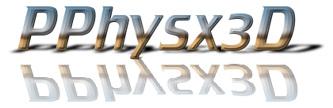

# PPhysx3d: an isaklar-ahanifi-maltebl-lervik-project


**PPhysx3d**: Probably Physics in 3D - is an attempt at a 3D Physics engine built in 🦀 rust 🦀 using [nalgebra](https://github.com/dimforge/nalgebra) for vector math. The engine comes with a bare bones [Kiss3D](https://github.com/sebcrozet/kiss3d) renderer to allow rendering of examples, but the engine should be able to interface with any similarly structured rendering solution. 

### Examples
... can be found in  `/examples/` can be run using the standard `cargo run --example` to reveal 𝒾𝓂𝓅𝓇𝑒𝓈𝓈𝒾𝓋𝑒 results, such as from  `demo_many.rs` shown below (NOTE: Color is distorted in gif making process):


## General use
Examples of how to use the physics engine and the renderer are to be found under `/examples/` but are generally consists of:

```rust
//Importing necessary material
extern crate pphysx3d;
use pphysx3d::{
    renderer::Kiss3dRenderer,
    scene::{
        game_object::GameObject,
        PhysicsScene,
    },
};

//Initializing the renderer and the physics scene
let mut renderer = Kiss3dRenderer::new("Demo", 1200, 900);
let mut scene = PhysicsScene::new();

//Creating a GameObject to put in the Physics Scene. Easiest way is to use one of the '<shape>_default' methods.
let mut sphere_1 = GameObject::Sphere_default(0.4, [0, 0, 0], [1.0, 2.0, 10.], 10., 1., 0.01);

//Adding or modifying starting values, such as velocity/acceleration/rotation etc.
sphere_1.add_velocity([10.0, 0.0, 0.0]);

//Adding GameObject to scene and renderer at the same time to make sure they are synced.
renderer.add_obj(&sphere_1).unwrap();
scene.add(sphere_1);

/*
More objects and setup...
*/

//Starting the Main loop!
loop {
    //Increment time by specific timestep and simulate physics
    scene.update(0.007);
    //Draw changes
    renderer.draw(&scene.objects()).unwrap();
}
```

## More info
... such as what is and is not yet implemented, is found in `SPECIFICATION.md`