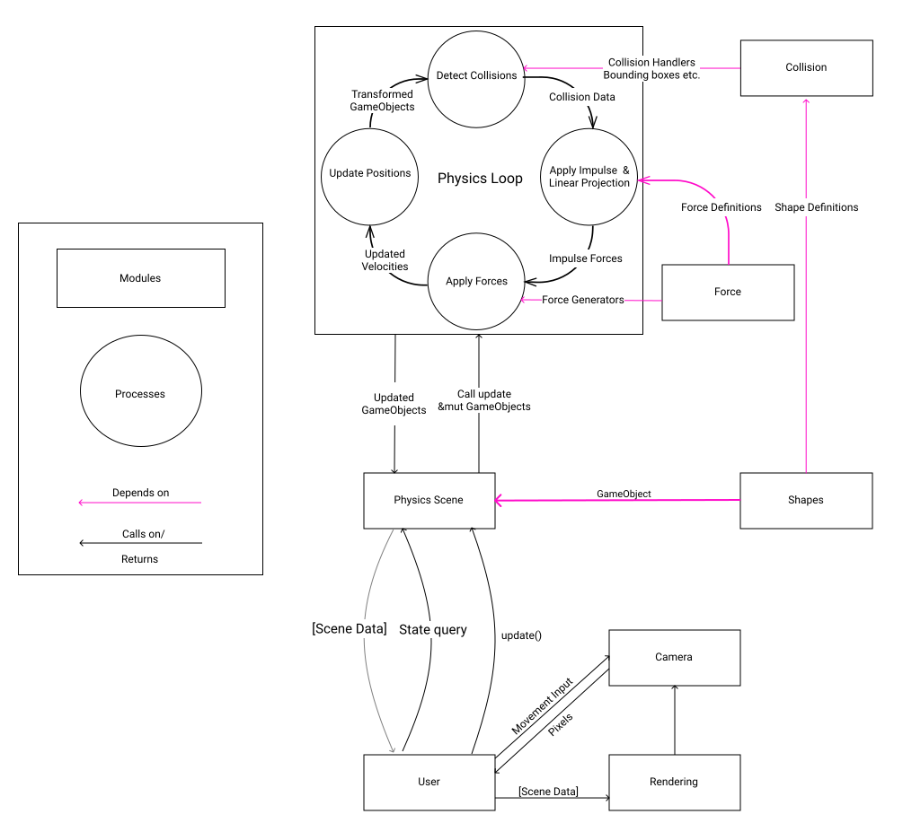

# Specification

* This is an attempt at a 3D physics engine found at https://github.com/INDAPlus20/isaklar-ahanifi-maltebl-lervik-project
* Issues should be as short as possible, yet informative. 
* Branches shall be named akin to `bug/13_ground-friction` meaning: `<branch-type>/<issue#>_<shortened-issue-description>`
* Commits should be named according to the whims of the author.
* In case of fire: Use issue-tag `Catastrophic`
* Pullreq must be accepted by atleast two people.

## Project

We are going to try to make a 3D physics engine in 🦀 rust 🦀. Inspiration drawn from, among many things: [nphysics](https://nphysics.org/) & [ncollide](https://www.ncollide.org/) and it's examples. A finished product with all features is not expected but above all goals stated in `Enjoyment` are sought. 

### Outline

* Rendering (As a start using [Kiss3D](https://github.com/sebcrozet/kiss3d)) ✅
    * Render frames continously ✅
    * Simulate camera movement  ✅
* Vector-math using [nalgebra](https://github.com/dimforge/nalgebra) ✅
* Define & render 3D objects    
    * Cubics
    * Spheres ✅
    * Planes ✅
    * Composite shapes
    * Contains_point(x,y,z)
* Basic movement    ✅
    * Coordinate position   
    * Velocity
    * Acceleration
    * Friction
    * Gravity
    * Rotation
* Geometric data
    * Mass  ✅
    * Center of mass    ✅
    * Bounding volumes  ✅
    * Contact   ✅
    * Proximity (check intersection if moving according to vector )
    * Time of impact
* Difficult movement
    * Inertia
    * Maximum velocity
    * Friction  ✅
* Advanced factors
    * Lighting and shading
    * Some sort of fluid dynamics
    * Air resistance
* If for some reason we have time
    * Create own OpenGL backend?
* More?

### Difficulties

* Coordination
* Math
* `git merge`
* Dividing up work
* Performance?

### Enjoyment
* Make lil'object go wooosh ✅

### Risks
* Laggy af
* It will take a while to get a basic scene
* Might not work correctly (collisions are hard)
* Project will branch very quickly once different types of geometric shapes are added.
* Very research-heavy with lots of rabbit-holes
* The implementation of the rendering is not very obvious.

## UML-like architecture for depicting the basic flow of the program
